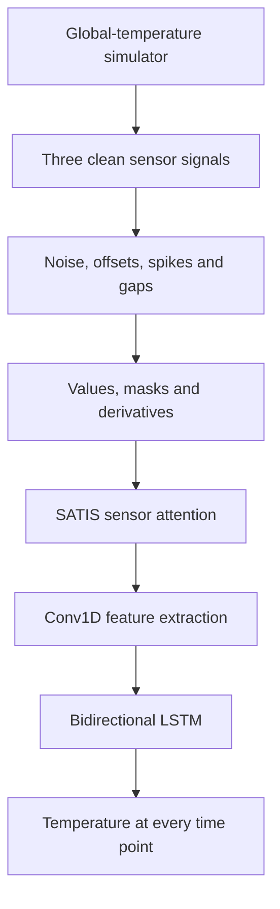

# Temperature Sequence Correction with SATIS Conv1D–BiLSTM

This repository explores neural-network methods for reconstructing a hidden
global-temperature sequence from three noisy and partially missing sensor
signals. The main model combines:

1. **SATIS-inspired sensor attention** to learn how much each sensor should
   influence the prediction at each time point;
2. **Conv1D** to extract short-range temporal patterns; and
3. **Bidirectional LSTM (BiLSTM)** to connect those patterns across the full
   sequence.

The repository currently uses synthetic data. Each clean sensor is an affine
transformation of a simulated global temperature, with additional Gaussian
noise, offset jumps, transient spikes, and missing intervals.

> **Recommended workflow:** use `sensor_simulator.py`, `training_model.py`, and
> `testing_model.py`. The other Python files are earlier or alternative
> experiments and are documented below.

## Repository structure

### Main workflow

| File | Purpose |
|---|---|
| `sensor_simulator.py` | Generates the hidden global-temperature traces and three corrupted sensor signals. It can return model-ready arrays or save all generated values to `sensor_data.csv`. |
| `training_model.py` | Main training-only script. Generates 1,000 traces, preprocesses them, performs a Huber-loss coordinate-descent search, trains the selected SATIS Conv1D–BiLSTM, and saves the model and preprocessing parameters. It deliberately does not evaluate the test set. |
| `testing_model.py` | Main evaluation-only script. Loads the saved model, creates new independent simulated traces, predicts without retraining, calculates residual statistics, and saves residual/error curves and numerical results. |
| `run_temp_seq_nn.sh` | Slurm batch script for the cluster. Its final command currently runs `testing_model.py`; change that line to `python training_model.py` when submitting a training job. Also adjust the `cd` path and requested resources for the machine being used. |

### Experimental scripts

| File | Purpose |
|---|---|
| `coordinate_config.py` | Original, extensively commented coordinate-descent experiment. It evaluates the broad Conv1D/BiLSTM search space, retrains the top five configurations, and plots their predictions for one fixed test sequence. |
| `coordinate_2.py` | More compact coordinate-descent experiment. It trains the selected configuration and plots four reproducibly random test sequences instead of only test sequence 0. |
| `coordinate_3.py` | Focused second-stage search around a large single Conv1D layer. It tests 192–512 filters, dilation 2–8, BiLSTM size 96–192, dropout, and learning rate. After selecting the architecture with Huber loss, it compares Huber, MAE, MSE, and Log-Cosh losses using common validation/test MAE and RMSE. |
| `test.py` | Alternative research branch. It adds a small bidirectional GRU that learns missing-value imputation and compares the Conv1D–BiLSTM backbone against a PatchTST-style transformer backbone. |
| `upgrade_satis.py` | More experimental upgraded pipeline: rolling Hampel-style spike removal, interpolation, time-since-last-observation features, volatility-based sample weights, residual Conv1D blocks with growing dilation, a persistence baseline, and a compact random search. |
| `main.py` | Project-template placeholder that only prints `Hello from temp-seq-nn!`; it is not part of the modelling pipeline. |
| `satis_conv_search_configuration2/coordinate_3.py` | Historical copy of the compact coordinate-search script. It differs from `coordinate_2.py` mainly in the output-directory name and should not be treated as a separate current entry point. |

### Configuration and generated files

| Path | Purpose |
|---|---|
| `pyproject.toml` | Python version and package dependencies. |
| `uv.lock` | Locked dependency versions for reproducible installation with `uv`. |
| `.python-version` | Preferred local Python version. |
| `sensor_data.csv` | Generated synthetic sensor dataset. This is an output/example dataset, not source code. |
| `satis_training_artifacts/` | Saved model, selected configuration, normalization statistics, training history, and held-out validation/test arrays from `training_model.py`. |
| `satis_evaluation_1000_traces/` | Stored evaluation results for 1,000 newly generated traces. |
| `satis_evaluation_5000_traces/` | Stored evaluation results for 5,000 newly generated traces. |
| `satis_conv_search_configuration*/` | Models, tables, prediction arrays, and figures produced by the coordinate-search and comparison experiments. |
| `satis_conv_search_results_v2/` | Stored outputs from an earlier upgraded-model experiment. The current `upgrade_satis.py` writes to `satis_conv_search_results_v3/`. |

Some experimental scripts share output-directory or output-file names. Run
them carefully if the existing results need to be preserved.

## Method overview



## Synthetic sensor simulator

The simulator is implemented in `sensor_simulator.py`.

### Global temperature

Each sequence is sampled on a uniform grid between 0 and 50. The default
model-ready generator uses 200 points. The hidden global temperature is the sum
of:

- a small sinusoidal component;
- a cumulative Gaussian random walk; and
- six finite-duration ramp-like shocks with random direction and amplitude.

In simplified form:

```text
global temperature = periodic component + random walk + shocks
```

### Clean sensors

Each sensor is generated independently as

```text
sensor = a + b × global_temperature + Gaussian noise
```

where `a` is sampled from `[-1.5, 1.5]` and `b` is sampled from `[0.5, 1.8]`
for every sensor in every sequence. The three sensor noise levels are 0.15,
0.20, and 0.25.

### Sensor corruption

`corrupt_sensor()` adds three kinds of faults:

- **offset jumps:** after a randomly selected time point, all later values are
  shifted;
- **transient spikes:** smooth Hanning-window pulses are added locally; and
- **missing gaps:** continuous sections are replaced by `NaN`.

The default corruption per sensor is two offset jumps, three spikes, and two
missing gaps of 8–24 points.

### Simulator functions

| Function | Return value |
|---|---|
| `make_sensor()` | One clean noisy affine sensor signal. |
| `corrupt_sensor()` | A copy of a sensor with offsets, spikes, and missing gaps. |
| `generate_one_dataset()` | One pandas DataFrame containing time, target temperature, and clean/noisy versions of all three sensors. |
| `generate_datasets()` | A single concatenated DataFrame containing multiple sequences and a `dataset_id` column. |
| `generate_ml_dataset()` | `(X, Y, dataset_ids, dataframe)`. Its direct `X` contains three mean-filled sensor channels plus three masks. The current training script uses the returned DataFrame and builds its own nine-channel representation. |
| `save_datasets()` | Generates a DataFrame and writes it to CSV. |

Generate the example CSV with:

```bash
uv run python sensor_simulator.py
```

The output is `sensor_data.csv`.

## Training model

The recommended training entry point is `training_model.py`.

### 1. Data preparation

The script generates 1,000 complete traces with seed 42. For each trace it:

1. selects `signal2_noisy`, `signal3_noisy`, and `signal4_noisy`;
2. identifies unusually large first differences with a median-absolute-
   deviation rule and changes those suspected spikes to `NaN`;
3. creates a three-channel observation mask (`1 = observed`, `0 = missing`);
4. replaces missing values with that sensor's mean within the sequence;
5. calculates the first difference of every filled sensor; and
6. concatenates the values, masks, and derivatives.

The final model input has nine channels at every time point:

```text
[sensor 1, sensor 2, sensor 3,
 mask 1,   mask 2,   mask 3,
 change 1, change 2, change 3]
```

With the current defaults, the complete array shape is `(1000, 200, 9)`.

### 2. Train/validation/test split

Complete traces are shuffled reproducibly and split as follows:

| Split | Traces | Used for |
|---|---:|---|
| Training | 700 | Updating the network weights |
| Validation | 150 | Hyperparameter selection, early stopping, and learning-rate reduction |
| Test | 150 | Saved for later evaluation; not used by `training_model.py` |

Sensor values and derivatives are standardized with statistics calculated only
from the training split. Masks remain exactly 0 or 1. The target temperature is
also standardized using the training target mean and standard deviation.

### 3. SATIS-inspired sensor attention

At every time point, a Dense layer produces three sensor scores. Missing-sensor
scores receive a very large negative penalty, and Softmax converts the remaining
scores to weights that add to one. The sensor values are multiplied by these
weights before entering the temporal model.

The weights control each sensor's influence; the highest-weight sensor is not
simply copied as the temperature prediction. The later Conv1D, BiLSTM, and Dense
layers combine all available evidence.

### 4. Conv1D and BiLSTM

The coordinate search changes:

- the number and width of Conv1D layers;
- kernel size;
- dilation rate;
- BiLSTM units;
- dropout; and
- Adam learning rate.

For a kernel size `k` and dilation `d`, a single Conv1D layer has an effective
temporal span

```text
1 + (k - 1) × d
```

Every Conv1D filter learns a different local pattern. The BiLSTM then connects
those local patterns across the complete sequence. Because
`return_sequences=True`, the model predicts one temperature for every input
time point.

The architecture is:

```text
9-channel sequence
    → masked sensor attention
    → one or more Conv1D + LayerNormalization blocks
    → bidirectional LSTM
    → Dropout
    → Dense(64, ReLU)
    → Dense(1) at every time point
```

This is an **offline sequence-correction model**: the bidirectional LSTM can use
both earlier and later points in the supplied sequence. It is not a strictly
causal, real-time predictor.

### 5. Hyperparameter search

`training_model.py` uses coordinate descent. It starts from one configuration,
changes one parameter at a time, keeps an improvement, and repeats for at most
three passes. Each candidate configuration is trained with seeds 1, 2, and 3.

Candidates are ranked with

```text
stability score = mean validation Huber loss + standard deviation
```

This favours both low error and repeatability across initializations. Candidate
training runs use at most 80 epochs. Early stopping restores the best validation
weights, and `ReduceLROnPlateau` halves the learning rate when validation loss
stops improving.

After the search, a fresh final model is trained for at most 200 epochs using
Huber loss and Adam.

### 6. Training outputs

`training_model.py` writes to `satis_training_artifacts/`:

| File | Contents |
|---|---|
| `best_satis_conv_bilstm_huber.keras` | Complete trained Keras model. |
| `best_config.json` | Selected architecture and learning settings. |
| `preprocessing_parameters.npz` | Training input/target means and standard deviations and normalized-channel indices. |
| `final_training_history.csv` | Final training and validation loss/MAE per epoch. |
| `hyperparameter_search_results.csv` | Unique configurations ranked by stability score. |
| `coordinate_search_all_trials.csv` | All search visits, including cached/revisited configurations. |
| `coordinate_search_trajectory.csv` | Parameter-by-parameter decisions made by coordinate descent. |
| `search_validation_loss_curves.csv` | Validation-loss curve for every configuration and seed. |
| `validation_data.npz` | Saved validation arrays and dataset IDs. |
| `test_data.npz` | Untouched held-out test arrays and dataset IDs. |
| `training_manifest.json` | Data seeds, shapes, input names, target name, and model path. |

The committed `best_config.json` currently records one Conv1D layer with 128
filters, kernel size 3, dilation 4, BiLSTM size 128, dropout 0.1, learning rate
0.001, and Huber loss. This describes the committed artifact; a new training
run may select a different configuration.

## Testing model

The recommended evaluation entry point is `testing_model.py`.

It does not call `model.fit()`. It:

1. imports the saved paths and spike-removal function from `training_model.py`;
2. checks that the saved Keras model and preprocessing parameters exist;
3. generates completely new traces with seed 1001;
4. reproduces the same nine-channel preprocessing;
5. applies the training normalization parameters without fitting new ones;
6. loads the saved model and predicts all traces;
7. converts predictions back to the original temperature scale; and
8. calculates residual, MAE, RMSE, standard error, and confidence-interval
   statistics.

The residual convention is

```text
residual = predicted temperature - true temperature
```

The source currently sets `N_EVALUATION_DATASETS = 5000`, despite an older
docstring that says 1,000. It therefore writes to
`satis_evaluation_5000_traces/` unless the constant is changed.

### Evaluation outputs

| File | Contents |
|---|---|
| `01_mean_residual_curve_5000_traces.png` | Mean residual at every time point, 95% confidence interval of the mean, and ±1 residual standard deviation. |
| `02_pointwise_mae_rmse_5000_traces.png` | MAE and RMSE as functions of time. |
| `pointwise_residual_statistics.csv` | Numerical point-wise residual/error statistics. |
| `per_trace_evaluation_metrics.csv` | Mean residual, residual spread, MAE, and RMSE for every trace. |
| `evaluation_summary.json` | Overall metrics and evaluation settings. |
| `evaluation_predictions_and_residuals.npz` | Time, IDs, targets, normalized predictions, physical-scale predictions, and residual arrays. |

The committed 5,000-trace summary reports a global mean residual of about
`-0.0116`, MAE `0.4783`, and RMSE `0.6565` in the simulator's temperature
units. These values describe that saved run only.

## Installation

The project requires Python 3.13 and declares NumPy, pandas, Matplotlib,
scikit-learn, TensorFlow, Optuna, Jupyter, and IPython kernel dependencies.

Using `uv`:

```bash
git clone https://github.com/aizzen3/temp_seq_correction_NN.git
cd temp_seq_correction_NN
uv sync
```

Activate the environment if desired:

```bash
source .venv/bin/activate
```

TensorFlow can run on CPU. Messages stating that CUDA drivers were not found
are informational when a CPU node is intentionally used.

## Recommended usage

### Train once

```bash
uv run python training_model.py
```

The hyperparameter search is computationally expensive because every candidate
is trained with three random seeds. On a cluster, edit `run_temp_seq_nn.sh` so
its final line is:

```bash
python training_model.py
```

Then submit it with:

```bash
sbatch run_temp_seq_nn.sh
```

### Evaluate repeatedly without retraining

After the model and preprocessing files exist:

```bash
uv run python testing_model.py
```

To change the size or identity of the synthetic evaluation set, edit:

```python
N_EVALUATION_DATASETS = 5000
EVALUATION_SEED = 1001
```

Keep the evaluation seed different from the training seed.

## Using the model with another dataset

### Required table structure

For the current code, a training/evaluation CSV should contain:

| Column | Required for inference? | Meaning |
|---|---:|---|
| `dataset_id` | Yes | Identifies one independent temperature trace. |
| `time` | Yes | Orders the measurements within each trace. |
| `signal2_noisy` | Yes | First sensor input. |
| `signal3_noisy` | Yes | Second sensor input. |
| `signal4_noisy` | Yes | Third sensor input. |
| `global_temperature` | Training/evaluation only | Ground-truth target. It is not required when only producing unknown predictions. |

The current saved model was trained with exactly three sensors and 200 time
points per trace. New input should therefore have the same sensor order,
comparable units/distribution, equivalent time spacing, and the same sequence
length. Resample, crop, or pad different-length traces consistently before
prediction. A different number of sensors requires retraining and architecture
changes because the attention block is hard-coded for three sensors.

### Train on a different labelled dataset

In `training_model.py`, replace the simulator call inside `prepare_dataset()`:

```python
_, _, _, dataframe = generate_ml_dataset(
    n_datasets=N_DATASETS,
    seed=DATA_SEED,
)
```

with:

```python
dataframe = pd.read_csv("my_training_data.csv")
```

Then keep the remaining grouping, preprocessing, trace-level splitting, and
training-only normalization unchanged. Do not randomly split individual time
points: complete traces must remain entirely within one split.

### Predict an external CSV with the saved model

The following example reproduces the preprocessing used during training and
writes a predicted temperature for every row. It does not retrain the model.

```python
import os

import numpy as np
import pandas as pd
import tensorflow as tf

from training_model import (
    ARTIFACT_DIR,
    MODEL_PATH,
    SPIKE_THRESHOLD,
    remove_sudden_spikes_as_missing,
)

INPUT_PATH = "my_sensor_data.csv"
OUTPUT_PATH = "my_temperature_predictions.csv"
PREPROCESSING_PATH = os.path.join(
    ARTIFACT_DIR,
    "preprocessing_parameters.npz",
)

input_columns = [
    "signal2_noisy",
    "signal3_noisy",
    "signal4_noisy",
]

dataframe = pd.read_csv(INPUT_PATH)
dataset_ids = np.asarray(sorted(dataframe["dataset_id"].unique()))

X_sequences = []
ordered_frames = []

for dataset_id in dataset_ids:
    sequence = dataframe[
        dataframe["dataset_id"] == dataset_id
    ].sort_values("time").copy()

    X_raw = sequence[input_columns].to_numpy()
    X_cleaned = remove_sudden_spikes_as_missing(
        X_raw,
        threshold=SPIKE_THRESHOLD,
    )

    mask = (~np.isnan(X_cleaned)).astype(float)
    column_means = np.nanmean(X_cleaned, axis=0)
    column_means = np.where(np.isnan(column_means), 0.0, column_means)
    X_filled = np.where(np.isnan(X_cleaned), column_means, X_cleaned)
    derivatives = np.diff(
        X_filled,
        axis=0,
        prepend=X_filled[:1],
    )

    X_sequences.append(
        np.concatenate([X_filled, mask, derivatives], axis=1)
    )
    ordered_frames.append(sequence)

X = np.stack(X_sequences)

with np.load(PREPROCESSING_PATH, allow_pickle=False) as parameters:
    X_mean = parameters["X_mean"]
    X_std = parameters["X_std"]
    Y_mean = parameters["Y_mean"]
    Y_std = parameters["Y_std"]
    normalized_channels = parameters[
        "normalized_input_channels"
    ].astype(int)

X[:, :, normalized_channels] = (
    X[:, :, normalized_channels] - X_mean
) / X_std

model = tf.keras.models.load_model(MODEL_PATH, compile=False)
Y_normalized = model.predict(X, batch_size=32)
Y_predicted = Y_normalized * Y_std + Y_mean

output_frames = []
for index, sequence in enumerate(ordered_frames):
    result = sequence[["dataset_id", "time"]].copy()
    result["predicted_global_temperature"] = Y_predicted[index, :, 0]

    if "global_temperature" in sequence.columns:
        result["global_temperature"] = sequence[
            "global_temperature"
        ].to_numpy()
        result["residual"] = (
            result["predicted_global_temperature"]
            - result["global_temperature"]
        )

    output_frames.append(result)

pd.concat(output_frames, ignore_index=True).to_csv(
    OUTPUT_PATH,
    index=False,
)
```

### Important limitations for real data

- The simulator assigns a new random offset and scale to every sensor in every
  trace. Real sensor calibration and drift may follow a different distribution.
- Mean filling and the BiLSTM use full-sequence context, so the current pipeline
  is offline rather than strictly real-time.
- The model has only been validated on synthetic data. Performance on real MMC
  or SQUID measurements must be established with held-out labelled real traces.
- Point-wise residuals within a time sequence are correlated; they should not be
  treated as independent experimental samples.
- If the real data distribution differs strongly from the simulator, retraining
  or fine-tuning on representative labelled real data is preferable to applying
  the saved synthetic model directly.
- The experimental scripts should not be compared only by plots from a few
  traces. Use the same held-out split and report MAE, RMSE, bias, and uncertainty.

## Current experimental observations

The stored experiment outputs show that:

- the focused loss comparison selected MAE by validation MAE for its fixed
  architecture, although `training_model.py` deliberately keeps Huber as the
  main training loss;
- the stored Conv1D–BiLSTM comparison outperformed the patch-transformer branch
  on that particular synthetic test split; and
- the model should always be compared against a simple baseline. In one stored
  upgraded-model run, the persistence baseline was better than the learned
  model, showing that additional architectural complexity does not automatically
  improve prediction.

These are experiment-specific results, not claims of performance on real
temperature data.

## Reproducibility notes

- Training data seed: `42`
- Coordinate-search seeds: `1`, `2`, `3`
- Independent evaluation seed: `1001`
- Main loss: Huber with `delta=1.0`
- Main optimizer: Adam
- Main batch size: `32`
- Search training budget: up to `80` epochs
- Final training budget: up to `200` epochs

## License

No license file is currently included. Add a license before expecting others to
reuse, modify, or redistribute the project.